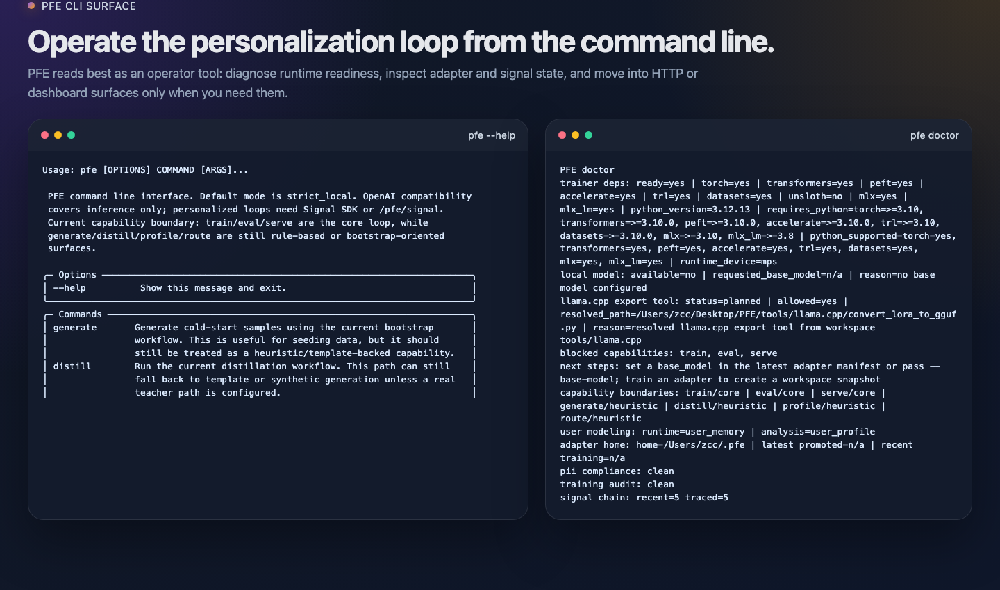
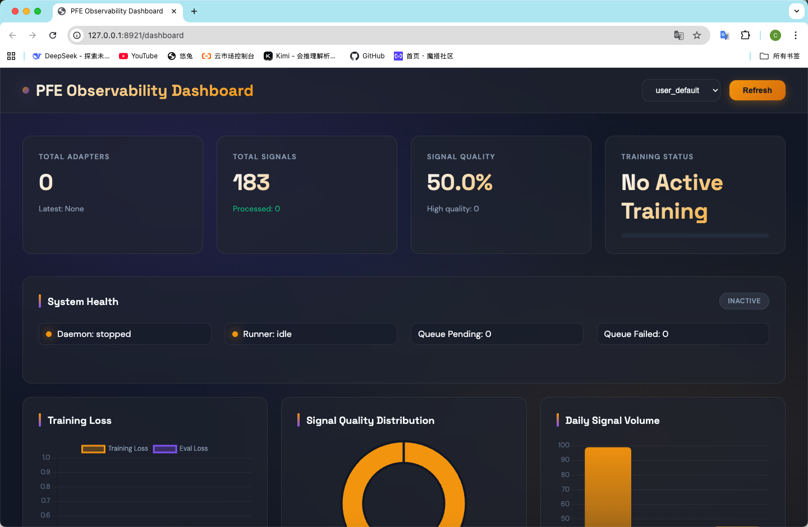

# Personal Finetune Engine (PFE)

English | [简体中文](README.zh-CN.md)

Personal Finetune Engine is a local-first engine for turning user feedback and behavior into a continuous small-model personalization loop.

```text
collect -> curate -> train -> eval -> promote -> serve
```

[Quick Start](#quick-start) • [Core CLI Workflow](#core-cli-workflow) • [Screenshots](#screenshots) • [Platform Support](#platform-support) • [Docs](#docs)

PFE is best understood as operator infrastructure rather than a turnkey consumer app. The main surface is the `pfe` CLI, with local HTTP and browser companions for serving and observability.

## What PFE Covers

- Local readiness checks, diagnostics, and operator views
- Signal collection, curation, and data controls
- SFT and DPO training paths
- Evaluation, candidate handling, promotion, and archive workflows
- Queue, trigger, daemon, and recovery controls
- OpenAI-compatible local serving plus dashboard and chat surfaces

## Quick Start

Bootstrap a local environment:

```bash
tools/bootstrap_py311_env.sh
source .venv/bin/activate
```

The bootstrap script installs the lightweight `dev` extra by default. To include
real training dependencies, opt in explicitly:

```bash
PFE_BOOTSTRAP_EXTRAS=dev,training tools/bootstrap_py311_env.sh
```

Recommended first commands:

```bash
pfe init --workspace user_default --base-model Qwen/Qwen2.5-3B-Instruct
pfe doctor
pfe next --workspace user_default
pfe status --json
pfe console --cycles 1
```

Start local serving:

```bash
pfe serve --port 8921 --live
```

Open observability:

```bash
pfe dashboard
```

Run the fast test layers:

```bash
make smoke-first-run
make smoke-auto-train-queue
make smoke-real-local-readiness
make smoke-server-live
make smoke-dashboard-console-live
make smoke-browser-ui-live
make test
make test-unit
make test-surface
make test-e2e-mock
```

`make smoke-first-run` runs
`pfe init -> doctor -> next -> generate -> trigger configure -> collect ingest/status/review -> trigger status/process-next -> eval -> promote -> serve`
inside an isolated temp directory. It requires no network, real model download,
or long-running server.

`make smoke-auto-train-queue` runs the same isolated path but stops after the
auto-train queue item is processed and the mock adapter manifest is visible.

`make smoke-real-local-readiness` validates the no-download real-local preflight:
local model discovery, `pfe train --real-local --preview`, serve preview, and a
console snapshot.

`make smoke-server-live` builds an isolated mock-local adapter, launches
`pfe serve --live` on a temporary loopback port, then probes `/healthz`,
`/pfe/status`, `/dashboard`, `/pfe/dashboard/metrics`, and
`/v1/chat/completions` over HTTP.

`make smoke-dashboard-console-live` launches the same kind of temporary live
server, then checks the dashboard HTML/API endpoints plus the chat-console
chat/feedback round trip.

`make smoke-browser-ui-live` is an optional Playwright smoke. It executes
dashboard refresh plus chat/feedback interactions in a real browser when the e2e
extras and Chromium browser are installed; otherwise it skips with setup
instructions.

`make smoke-real-local-happy` is opt-in. Set `PFE_REAL_LOCAL_MODEL` to a local
model/config directory with training extras installed to run a true
`pfe train --real-local` happy path.

Default local pages:

```text
http://127.0.0.1:8921/dashboard
http://127.0.0.1:8921/
```

Notes:

- `pfe serve --port 8921` without `--live` shows the serve plan only.
- `127.0.0.1:8921` is the default local bind, not a fixed requirement.
- If no promoted adapter is available, serving can stay in safe or mock mode.
- Real local model loading is gated behind explicit runtime configuration such as `--real-local`.

## Core CLI Workflow

Typical operator path:

```bash
# 1. Create the local .pfe workspace and default config
pfe init --workspace user_default --base-model Qwen/Qwen2.5-3B-Instruct

# 2. Verify the local runtime
pfe doctor

# 3. Inspect current engine state
pfe next --workspace user_default
pfe status --json

# 4. Open the live terminal surface
pfe console --cycles 1

# 5. Preview real local training before installing heavier dependencies
pfe train --backend peft --real-local --preview --epochs 1

# 6. Start local serving
pfe serve --port 8921 --live

# 7. Open observability
pfe dashboard
```

Command families:

- Workspace setup: `pfe init --workspace user_default --base-model <path-or-id>`
- Inspect: `pfe doctor`, `pfe next`, `pfe status --json`, `pfe console`
- Train and evaluate: `pfe train`, `pfe dpo`, `pfe eval`
- Lifecycle: `pfe adapter`, `pfe candidate`
- Automation: `pfe trigger`, `pfe daemon`, `pfe eval-trigger`
- Collection and data: `pfe collect`, `pfe data`

When your workspace, base model, and adapter flow are configured, continue with:

```bash
pfe train --backend peft --real-local --preview
pfe train --help
pfe dpo --help
pfe eval --help
pfe adapter --help
pfe trigger --help
```

## Screenshots

Real visuals from a local run in this repository.

CLI surfaces generated from real `pfe --help` and `pfe doctor` output:

<p align="center">
  
</p>

Dashboard at `/dashboard` after `pfe serve --port 8921 --live`:

<p align="center">
  
</p>

The browser dashboard is a companion surface. The main control plane remains the CLI.

## Platform Support

- Best-supported local path today: `macOS` on Apple Silicon
- Also supported in the codebase: `Linux/CUDA` and `CPU-only` fallback paths
- `Windows` is not currently documented as a primary target

## Default Network Settings

- Default host: `127.0.0.1`
- Default port: `8921`
- Both can be overridden, for example: `pfe serve --host 127.0.0.1 --port 3000 --live`

## HTTP And Browser Surfaces

PFE also exposes local HTTP and browser companions:

- `GET /healthz`
- `GET /pfe/status`
- `GET /dashboard`
- `POST /v1/chat/completions`

Bundled browser pages live under:

- `pfe-server/pfe_server/static/dashboard.html`
- `pfe-server/pfe_server/static/chat.html`

## Repository Layout

```text
pfe-core/    Core engine and training pipeline
pfe-cli/     CLI entrypoints and console workflows
pfe-server/  FastAPI server and HTTP surfaces
tests/       Unit, surface, integration, and e2e coverage
docs/        Public docs, guides, references, and archive
examples/    Example assets and scenarios
tools/       Repository-local helper scripts
```

## Project Status

- Phase 1 complete
- Phase 2 functional closeout complete; release-readiness validation remains
- Public repository prepared with large local artifacts intentionally excluded

See [docs/reference/phase2-closeout.md](docs/reference/phase2-closeout.md) for the closeout note.

## Docs

- [README.zh-CN.md](README.zh-CN.md)
- [docs/README.md](docs/README.md)
- [docs/guides/beta-local-runbook.md](docs/guides/beta-local-runbook.md)
- [ENGINE_DEV_DOC.md](ENGINE_DEV_DOC.md)
- [docs/reference/phase2-closeout.md](docs/reference/phase2-closeout.md)

## License

MIT. See [LICENSE](LICENSE).

## Repository Boundaries

This repository does not include:

- local model weights
- training outputs
- virtual environments
- package caches
- vendored `llama.cpp` checkout and build artifacts

Those assets are environment-specific and should stay outside the published source repository.
