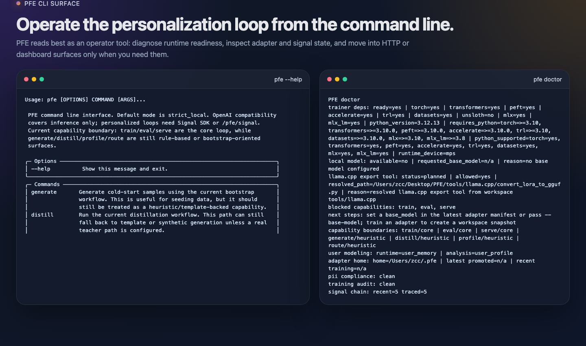

# Personal Finetune Engine (PFE)

[English](README.md) | 简体中文

Personal Finetune Engine 是一个本地优先的个性化引擎，用来把用户反馈与行为信号沉淀成一个持续的小模型优化闭环。

```text
collect -> curate -> train -> eval -> promote -> serve
```

[快速开始](#快速开始) • [CLI 主路径](#cli-主路径) • [截图](#截图) • [平台支持](#平台支持) • [文档入口](#文档入口)

PFE 更适合被理解为一套面向操作者的本地基础设施，而不是一个开箱即用的消费级聊天产品。它的主入口是 `pfe` CLI，本地 HTTP 与浏览器界面主要承担服务暴露和观测配套角色。

## PFE 覆盖什么

- 本地环境检查、诊断和运维视图
- 信号采集、curation 和数据控制
- SFT 与 DPO 训练路径
- 评估、candidate 处理、promote 与 archive 流程
- 队列、trigger、daemon 与恢复控制
- OpenAI 兼容的本地服务，以及 dashboard 和 chat 配套界面

## 快速开始

先准备本地环境：

```bash
tools/bootstrap_py311_env.sh
source .venv/bin/activate
python -m pip install -e ".[dev]"
```

建议先跑这几个命令：

```bash
pfe doctor
pfe status --json
pfe console --cycles 1
```

启动本地服务：

```bash
pfe serve --port 8921 --live
```

打开观测面板：

```bash
pfe dashboard
```

默认本地页面：

```text
http://127.0.0.1:8921/dashboard
http://127.0.0.1:8921/
```

说明：

- 不带 `--live` 的 `pfe serve --port 8921` 只会展示启动计划。
- `127.0.0.1:8921` 只是默认本地监听地址，不是硬编码要求。
- 如果当前没有 promoted adapter，服务可以保持在 safe 或 mock 模式。
- 真正加载本地模型通常需要显式 runtime 配置，例如 `--real-local`。

## CLI 主路径

一条典型的操作者路径：

```bash
# 1. 先确认本地运行环境是否 ready
pfe doctor

# 2. 查看当前引擎状态
pfe status --json

# 3. 打开实时终端面板
pfe console --cycles 1

# 4. 启动本地服务
pfe serve --port 8921 --live

# 5. 打开观测面板
pfe dashboard
```

命令分组：

- 检查与观测：`pfe doctor`、`pfe status --json`、`pfe console`
- 训练与评估：`pfe train`、`pfe dpo`、`pfe eval`
- 生命周期管理：`pfe adapter`、`pfe candidate`
- 自动化控制：`pfe trigger`、`pfe daemon`、`pfe eval-trigger`
- 采集与数据：`pfe collect`、`pfe data`

当 workspace、base model 和 adapter 流程配置好以后，可以继续看：

```bash
pfe train --help
pfe dpo --help
pfe eval --help
pfe adapter --help
pfe trigger --help
```

## 截图

以下画面都来自这个仓库上的真实本地运行。

CLI 画面来自真实 `pfe --help` 和 `pfe doctor` 输出：

<p align="center">
  
</p>

执行 `pfe serve --port 8921 --live` 后访问 `/dashboard`：

<p align="center">
  
</p>

浏览器 dashboard 是补充 surface，主控制面仍然是 CLI。

## 平台支持

- 当前最顺滑、最优先的本地路径：`macOS` + Apple Silicon
- 代码层已覆盖：`Linux/CUDA` 与 `CPU-only` fallback 路径
- `Windows` 目前还不适合写成主要支持平台

## 默认网络配置

- 默认 host：`127.0.0.1`
- 默认 port：`8921`
- 都可以覆盖，例如：`pfe serve --host 127.0.0.1 --port 3000 --live`

## HTTP 与浏览器 Surface

PFE 也提供本地 HTTP 与浏览器配套界面：

- `GET /healthz`
- `GET /pfe/status`
- `GET /dashboard`
- `POST /v1/chat/completions`

仓库内置页面位于：

- `pfe-server/pfe_server/static/dashboard.html`
- `pfe-server/pfe_server/static/chat.html`

## 仓库结构

```text
pfe-core/    核心引擎与训练流水线
pfe-cli/     CLI 入口与终端工作流
pfe-server/  FastAPI 服务与 HTTP surface
tests/       单元、surface、integration、e2e 测试
docs/        公开文档、指南、参考与归档
examples/    示例资源与场景
tools/       仓库内辅助脚本
```

## 项目状态

- Phase 1 已完成
- Phase 2 已完成
- 公开仓库版本已经整理完成，大体积本地资产继续排除在仓库之外

Phase 2 收尾说明见 [docs/reference/phase2-closeout.md](docs/reference/phase2-closeout.md)。

## 文档入口

- [README.md](README.md)
- [docs/README.md](docs/README.md)
- [ENGINE_DEV_DOC.md](ENGINE_DEV_DOC.md)
- [docs/reference/phase2-closeout.md](docs/reference/phase2-closeout.md)

## 许可证

MIT，见 [LICENSE](LICENSE)。

## 仓库边界

这个仓库不包含：

- 本地模型权重
- 训练输出
- 虚拟环境
- 包缓存
- vendored `llama.cpp` checkout 和构建产物

这些内容都属于环境相关资产，不应放进公开源码仓库。
